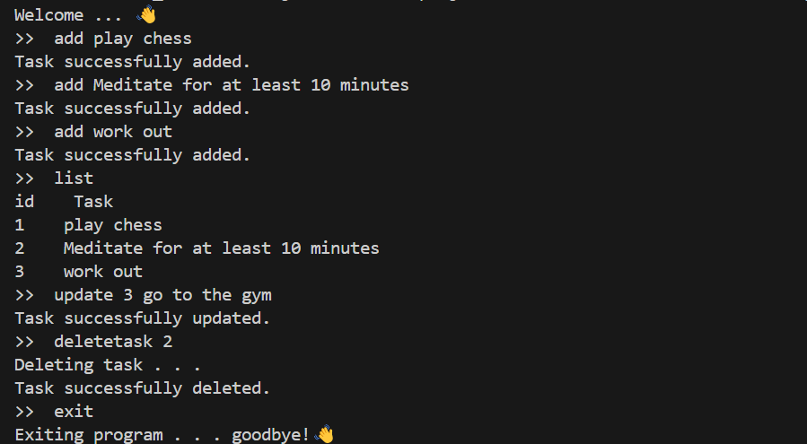

# Task CLI

A simple command-line interface (CLI) application to track and manage your daily tasks directly from the terminal. Built using Node.js with no external libraries.
Project idea came from https://roadmap.sh/projects/task-tracker

## Features

- **Add** a new task
- **Update** a task's description
- **Delete** a task
- **Mark** a task as `in-progress` or `done`
- **List** all tasks
- **Filter** tasks by their status (`todo`, `in-progress`, `done`)

## Getting Started

### Prerequisites

- Node.js installed on your system

### Running the CLI

```bash
node index.js <command> [arguments]
```

To create an interface run:

```bash
node main.js
```

## Usage Examples



## Task Structure

Each task in the JSON file has the following structure:

```json
{
  "id": 1,
  "description": "Buy groceries",
  "status": "todo",
  "createdAt": "2025-04-23T14:00:00Z",
  "updatedAt": "2025-04-23T14:00:00Z"
}
```

## File Storage

Tasks are stored in a `tasks.json` file located in the current directory. This file is created automatically if it doesn’t exist.

## Error Handling

- Invalid command arguments
- Task ID not found
- Malformed task file
